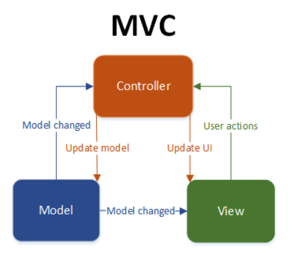
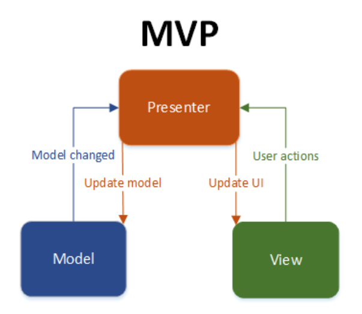
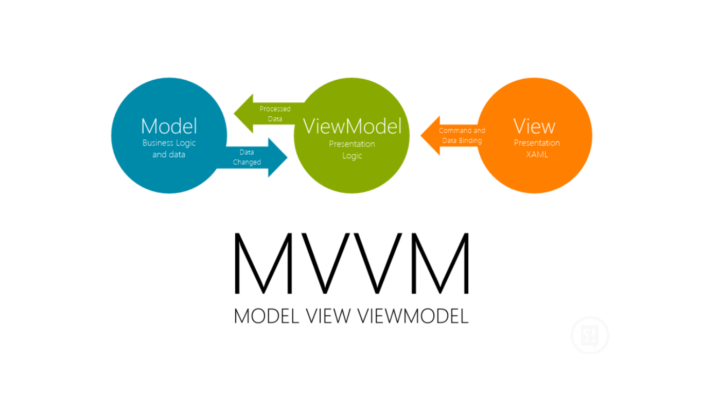

MVVM Design Pattern
==

###### created by Kimjiwon on 2017.12.22
----

>### 디자인 패턴?

- 소프트웨어 설계에서 자주 활용되는 구조의 모음이나, 나타나는 다양한 패턴들을 정리한 것.
- 디자인 패턴의 종류는 크게 생성, 구조, 행위 세가지의 패턴으로 나뉘어져 있다.

1. 생성 패턴(Builder, Dependency Injection, Singleton)
	- 객체 생성에 대해 다루고 상황에 적절한 객체를 만드는 것.

2. 구조 패턴(Adapter, Facade)
	- 작은 클래스의 합성 및 재조합을 통해 더 큰 클래스 구조를 형성하기 위한 패턴.

3. 행위 패턴(Command, Observer, MVC, MVP, MVVM)
	- 객체들의 행위를 조직, 관리, 조합하는데 사용하는 패턴.
	- 객체들이 다른 객체와 상호작용하는 방식을 규정.
	- 각각 다른 객체들과 통신하는 방법과 객체의 책임을 규정하여 복잡한 행위들을 관리할 수 있도록 함.
	- 두 객체 간의 관계에서부터 앱의 전체 아키텍처에 까지 영향을 미침.

###### 이번 자료에서는 행위 패턴에 속해있는 MVC, MVP, MVVM 패턴의 특징을 간단히 알아보고, MVVM 패턴을 적용한 DataBinding에 대해 알아본다. 

---
 

>### 1. MVC, MVP, MVVM.

#### MVC 패턴

- Model View Controller의 약자로 현재 여러 플랫폼에서 사용중인 아키텍쳐 패턴.
	- Model : 데이터, 상태, 비지니스 로직을 담고있음.
		- View나 Controller에 묶이지 않기때문에 많은 곳에서 재사용할 수 있다.
	- View : Model의 표현.
		- 사용자가 앱과 상호작용을 할 때, Controller와 통신하는 역할을 맡음.
	- Controller : Model과 View사이를 연결 해주는 역할.
		- View에서 이벤트가 발생하면, Controller에서 어떻게 Model과 상호작용할지 결정.
		- Model에서 데이터가 변경되는 것에 따라 Controller는 View의 상태를 적절히 업데이트 하도록 결정.
		- 주로 Activity나 Fragment로 표현 됨.

- 모든 입력은 Controller에서 처리되며, Controller로 입력이 들어오게 되면 Controller는 입력에 해당하는 Model을 조작하고 Model을 나타내줄 View를 선택.
- Controller는 View를 선택하여 Model을 전달해줌. 이때, View를 선택만 하고 업데이트는 해주지 않기 때문에 Model을 이용하여 업데이트 하게 됨.

### 특징
- UI로부터 비지니스 로직을 분리하여 서로 영향 없이 쉽게 고칠 수 있는 어플리케이션 개발 가능.
- Activity(Controller)에 너무 많은 소스가 집약 될 우려가 있음.
- View는 Model을 이용하기 때문에 서로간의 의존성을 완벽히 배제할 수 없다.

 

#### MVP 패턴

- Model View Presenter의 약자
	- Model : 데이터, 상태, 비지니스 로직을 담고있음(MVC패턴의 Model과 동일).
	- View
		- MVC패턴에서의 Controller의 역할을 하던 Activity와 Fragment가 View의 일부로 간주됨.
	- Presenter : Model과 View 사이를 연결해주는 역할.
		- MVC패턴의 Controller와 같지만, 인터페이스로 구성된다는 점이 차이.
		- View에게 데이터와 어떻게 표시할 것인지를 지시하는 것이 아닌, 데이터만 전달한다는 점이 MVC패턴과 차이점.

- 입력을 View에서 처리하며, Presenter에서는 View의 인스턴스를 이용해 1:1관계를 유지.
- View에서 이벤트가 발생하면 Presenter에게 전달해주고, Presenter는 해당 이벤트에 따른 Model을 조작하여 그 결과를 View에게 통보하여 View를 업데이트.

### 특징
 - MVC패턴보다 깔끔한 형태를 유지(주의가 필요한 것들의 분할을 잘 이루어지게 해준다).
 - 많은 인터페이스가 생기기 때문에 작은 앱이나 프로토타입을 개발할 때 불필요할 수 있는 작업들이 생김.
 - 코드가 많아질수록 유지보수가 어려워짐(프리젠터에 여러 비지니스 로직들이 모이게 될 우려가 있음).

 

#### MVVM 패턴

- Model View ViewModel의 약자
	- Model : 데이터, 상태, 비지니스 로직을 담고있음(MVC패턴의 Model과 동일).
	- View : View는 ViewModel에 의해 변수와 액션에 유연하게 바인딩.
	- ViewModel : View를 나타내주기 위한 Model. View보다는 Model과 유사하게 디자인 됨.
		- View와의 상호작용 및 제어에 집중.
		- ViewModel에서 직접 View의 이벤트를 처리.

- Model이 업데이트되면 해당 View는 ViewModel을 통해 자신을 업데이트 하고, 사용자가 View와 상호작용할 때 Model은 ViewModel을 통해 업데이트 된다.

### 특징
- Command와 DataBinding을 통해 View와의 의존성을 완벽히 분리 할 수 있다.
- Command를 통하여 리스너를 View의 이벤트와 연결 할 수 있으며, ViewModel의 속성과 특정 View의 속성을 Binding시켜 줌으로써 ViewModel속성이 변경 될 때마다 View를 업데이트 시킬 수 있다.
- ViewModel에서 Controller의 역할도 함께 수행하기 때문에 코드가 집중 될 수 있음.
- 초기화와 View에 의한 것이 아닌 이벤트를 제외하고는 Activity의 역할이 모호해진다.

---
 

#### 참고 자료:

 * [Android Design Pattern](https://academy.realm.io/kr/posts/eric-maxwell-mvc-mvp-and-mvvm-on-android/) for Realm(by Eric Maxwell)
 * [Android Design Pattern](http://chuumong.github.io/android/2017/01/16/%EC%95%88%EB%93%9C%EB%A1%9C%EC%9D%B4%EB%93%9C-%EB%94%94%EC%9E%90%EC%9D%B8-%ED%8C%A8%ED%84%B4) for chumming.github.io
 * [Android Architecture Pattern](https://medium.com/nspoons/%EC%95%88%EB%93%9C%EB%A1%9C%EC%9D%B4%EB%93%9C-architecture-%ED%8C%A8%ED%84%B4-part-3-%EB%AA%A8%EB%8D%B8-%EB%B7%B0-%EB%B7%B0%EB%AA%A8%EB%8D%B8-model-view-viewmodel-688f8d93d557) for Medium(by Jong Yun Lee)
 * [mvc, mvp pattern](https://medium.com/@gumay.raditya/android-mvp-design-pattern-6a2b56c12ac4) for medium(by raditya gumay)
 * [mvvm pattern](https://rehansaeed.com/model-view-viewmodel-mvvm-part4-inotifydataerrorinfo/) for rehansaeed

> 예제 파일
> MVVMDesignPatternEx - MVVM디자인패턴을 간단하게 확인할 수 있는 예제.

