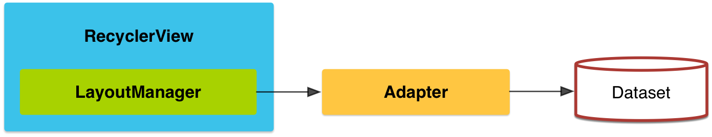
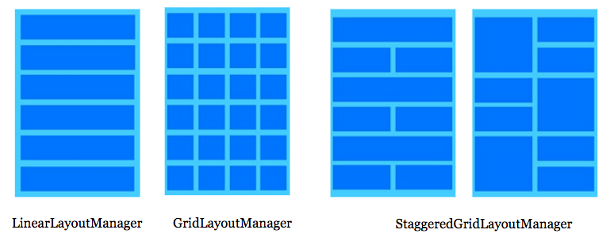

RecyclerView
====

###### created by Kimjiwon on 2017.12.28
----


> ### RecyclerView

- 기존에 사용되던 ListView에서 더욱 향상되고 유연해진 버전의 ListView.
- ListView에서 선택적으로 사용되던 ViewHolder 패턴을 강제적으로 사용.
- 뷰의 커스터마이징과, 간단하게 애니메이션을 지정 가능.
- 구분선을 사용할 때는 ListView에서는 divider를 사용하여 구현하지만, RecyclerView에서는 ItemDecorator를 이용하여 구현.
- LayoutManager를 이용하여 RecyclerView 내부의 아이템들을 어떻게 배치할 것인지 지정 가능.
- ListView에서 기본적으로 제공하던 Header와 Footer를 RecyclerView에서 사용하기 위해서는 따로 생성해 주어야 함.
- 안드로이드 API9버전 이전버전에서 호환하기 위해서 gradle에 support 라이브리러를 추가 해주어야 함.




> ### 주요 클래스

1. Adapter
2. ViewHolder
3. LayoutManager
4. ItemDecoration
5. ItemAnimation


> ### 1. Adapter

- 데이터와 아이템에 대한 뷰 생성(기존 ListView의 Adapter와 같은 개녕).
- 여러 Adapter를 구분하여 사용하던 ListView와는 다르게 하나의 Adapter를 사용하여 유연하게 데이터를 처리.
- 필수적으로 3개의 인터페이스를 구현해야 함.
	1. onCreateViewHolder : ViewHolder를 생성하고 View를 붙여줌.
	2. onBindViewHolder : 각각의 포지션에 따른 데이터를 ViewHolder에 바인딩
	3. getItemCount : 보여질 아이템의 갯수.


> ### 2. ViewHolder

- 작은 데이터 저장소를 만들어 각각의 리스트 아이템들의 아이디를 찾을필요 없이 바로 연결할수 있게 도와주는 클래스.
- 기존의 잦은 findViewById() 메서드를 호출하여 뷰를 수정하였던 방식을 ViewHolder를 이용하여 한번만 수행함으로써 성능을 향상시킴.


> ### 3. LayoutManager

- recyclerView의 아이템을 어떻게 배치 할 것인지 지정.
- ListView와는 다르게 수평/수직 스크롤을 지원.
- 3가지의 기본 LayoutManager를 제공.
	- LinearLayoutManager : 항목을 가로/세로 스크롤 목록으로 표시.
	- GridLayoutManager : 격자 형식으로 항목을 배치.
	- StaggeredGridLayoutManager : 지그재그형(각 아이템마다 크기가 다른)의 격자 형식으로 항목을 배치.




> ### 4. ItemDecotation

- 각 아이템의 항목에 오프셋을 추가하거나, 구분선을 넣는 등 아이템을 꾸미는 작업을 도와줌.

> ### 5. ItemAnimation

- 아이템이 변경될 때 애니메이션을 추가할 수 있게 도와줌.
- notifyItem 메서드를 사용하여 특정 아이템에 대한 애니메이션을 추가할 수 있다.

----
</br>

> ### DataBinding을 사용한 RecyclerView

보통 DataBinding을 사용하여 RecyclerView를 구성하기 위해서는 다음과 같은 순서를 가진다.

1. RecyclerView 및 아이템 layout 생성.
2. RecyclerView의 아이템에 표시할 데이터 객체 생성.
3. RecyclerView의 Adapter와 ViewHolder작성.
4. BindingAdapter를 이용하여 RecyclerViewAdapter와 RecyclerView 연결.
5. view의 Activity클래스와 Binding클래스를 연결 및 Binding클래스에 변수 값 세팅.

이후 자유롭게 추가적인 기능들을 추가한다.

#### 1. RecyclerView 생성.

xml상에 RecyclerView를 생성하고 LayoutManager를 설정.

``` xml
    <android.support.v7.widget.RecyclerView
        android:id="@+id/lecture_recyclerView"
        android:layout_width="897dp"
        android:layout_height="0dp"
        app:layoutManager="LinearLayoutManager"
        app:layout_constraintBottom_toBottomOf="parent"
        app:layout_constraintRight_toRightOf="parent"
        app:layout_constraintTop_toBottomOf="@+id/text" />
```

그 후, RecyclerView의 내부에 표시할 아이템에 대한 layout도 함께 생성해준다.

</br>

#### 2. Data Model 생성하기.

RecyclerView에 보여질 내용의 데이터 모델을 생성한다.

``` java
public class LectureData {
    
    // LectureRecyclerView의 아이템에 대한 데이터 객체.
    public String lectureNum;
    public String lectureTitle;
    public String lectureTime;
    public String lecturePage;

    public LectureData(String lectureNum, String lectureTitle, String lectureTime, String lecturePage) {
        this.lectureNum = lectureNum;
        this.lectureTitle = lectureTitle;
        this.lectureTime = lectureTime;
        this.lecturePage = lecturePage;
    }

}
```


#### 3. Adapter & ViewHolder 작성.
- viewHolder에 바인딩 객체를 생성하고 생성자에서 바인딩 객체를 받아 바인딩.

``` java
public static class LectureRecyclerViewHolder extends RecyclerView.ViewHolder {
    // Lecture 아이템의 바인딩객체.
    LectureRecyclerItemBinding lectureRecyclerItemBinding;

    // Adapter의 onCreateViewHolder에서 전달받은 Binding객체를 Holder에 바인딩.
    public LectureRecyclerViewHolder(LectureRecyclerItemBinding binding) {
        super(binding.getRoot());
        lectureRecyclerItemBinding = binding;
    }

    /.../
}
```

- viewHolder에 bind 변수를 생성하여 adapter의 onBindViewHolder에서 받는 데이터를 viewHolder에 바인딩.

``` java
private void bind(LectureData lectureData) {
    lectureRecyclerItemBinding.setLectureData(lectureData);
    lectureRecyclerItemBinding.setLectureViewModel(new LectureViewModel());
}
```

- Adapter에 멤버변수에 RecyclerView로 표현될 데이터인 ArrayList(혹은 Observable 객체) 생성.
- onCreateViewHolder, onBindViewHolder, getItemCount 오버라이드.
- onCreateViewHolder : viewHolder의 바인딩클래스에 뷰를 인플레이트하여 뷰홀더에 바인딩객체와 함께 반환.

``` java
@Override
public LectureRecyclerViewHolder onCreateViewHolder(ViewGroup parent, int viewType) {
    LectureRecyclerItemBinding binding = LectureRecyclerItemBinding.
            inflate(LayoutInflater.from(parent.getContext()), parent, false);
    return new LectureRecyclerViewHolder(binding);
}
```

- onBindViewHolder : 해당 포지션의 데이터를 viewHolder에 전달하여 바인드.

``` java
@Override
public void onBindViewHolder(LectureRecyclerViewHolder holder, int position) {
    LectureData lectureData = lectureList.get(position);
    holder.bind(lectureData);
}
```

- getItemCount : RecyclerView에서 표현할 아이템의 크기를 나타냄.

``` java
    // RecyclerView에 나타낼 아이템의 수를 반환.
    @Override
    public int getItemCount() {
        return lectureList.size();
    }
```

#### 4. BindingAdapter를 이용하여 RecyclerView와 RecyclerView.Adapter연결.
- BindingAdapter를 사용하여 xml상에서 RecyclerView ItemList를 받아서 BindingAdapter에서 처리.

``` java
    @BindingAdapter("item")
    public static void bindItem(RecyclerView recyclerView, ObservableArrayList<LectureData> lectureList) {
        LectureRecyclerAdapter adapter = (LectureRecyclerAdapter) recyclerView.getAdapter();
        adapter.setItem(lectureList);
    }
```

- layout의 recyclerView에 해당 속성 추가.

``` xml
<android.support.v7.widget.RecyclerView
    android:id="@+id/lecture_recyclerView"
    item="@{lectureViewModel.lectureList}"
    android:layout_width="897dp"
    android:layout_height="0dp"
    app:layoutManager="LinearLayoutManager"
    app:layout_constraintBottom_toBottomOf="parent"
    app:layout_constraintRight_toRightOf="parent"
    app:layout_constraintTop_toBottomOf="@+id/text" />
```

- Adapter에 BindingAdapter로 받아온 데이터를 처리하는 코드 추가.

``` java
    // BindingAdapter로 생성한 item속성으로 전달받은 데이터를 Adapter의 lectureList에 저장하기 위한 메소드.
    public void setItem(ObservableArrayList<LectureData> lectureList) {
        if (lectureList == null) {
            return;
        }
        this.lectureList = lectureList;
        notifyItemChanged(lectureList.size());
    }
```

#### 5. View RecyclerView에 Adapter 바인딩하기.

``` java
    @Override
    protected void onCreate(Bundle savedInstanceState) {
        super.onCreate(savedInstanceState);
        ActivityMainBinding binding = DataBindingUtil.setContentView(this, R.layout.activity_main);

        /.../

        // lectureRecyclerView에 LectureRecyclerViewAdapter 연결.
        LectureRecyclerAdapter adapter = new LectureRecyclerAdapter();
        binding.lectureRecyclerView.setAdapter(adapter);

    }
```

----
</br>

> ### ViewType

- RecyclerView에서는 ViewType에 따라 다른 뷰홀더를 바인딩 할 수 있다.
- ListView에서 자동으로 생성해주는 Header, Footer와 유사.
- Header, Footer 뿐만 아니라 사용자가 자유롭게 ViewType을 지정 가능.

#### 1. RecyclerView Adapter에 상수 ViewType지정해주기.
이 과정은 생략되어도 되지만, 가독성을 위해 추가

``` java
public class LectureRecyclerAdapter extends RecyclerView.Adapter<LectureRecyclerAdapter.LectureRecyclerViewHolder> {
    // 추가될 RecyclerView 아이템을 구분하는 viewType 상수.
    private static final int TYPE_ITEM = 0;
    private static final int TYPE_CHAPTER = 1;

    /.../
```

#### 2. getItemViewType 메서드를 오버라이드.
- 조건문을 통해 반환될 ViewType을 지정.

``` java
    @Override
    public int getItemViewType(int position) {
        if (lectureList.get(position).lectureNum != null) {
            return TYPE_ITEM;
        }
        return TYPE_CHAPTER;
    }
```

#### 3. viewHolder 분기.
- viewType에 따라 다른 viewHolder를 생성하기 위해 생성자를 나눈다.

``` java
public static class LectureRecyclerViewHolder extends RecyclerView.ViewHolder {
    // Lecture 아이템의 바인딩객체.
    LectureRecyclerItemBinding lectureRecyclerItemBinding;
    // Chapter 아이템의 바인딩객체.
    LectureRecyclerChapterBinding lectureRecyclerChapterBinding;

    public LectureRecyclerViewHolder(LectureRecyclerChapterBinding binding) {
        super(binding.getRoot());
        lectureRecyclerChapterBinding = binding;
    }

    // LectureRecyclerItemBinding과 LectureRecyclerChapterBinding을 매개변수로 받는 생성자를 각각 오버로딩.
    // Adapter의 onCreateViewHolder에서 전달받은 Binding객체를 Holder에 바인딩.
    public LectureRecyclerViewHolder(LectureRecyclerItemBinding binding) {
        super(binding.getRoot());
        lectureRecyclerItemBinding = binding;
    }

    /.../
}
```

- viewHolder의 bind메서드에 각각의 viewHolder의 바인딩 변수에 데이터를 연결해준다.

``` java
    // onBindViewHolder에서 받은 데이터와 viewType을 이용하여 해당 Holder의 xml에 존재하는 변수에 객체를 연결.
    private void bind(LectureData lectureData, int viewType) {
        if (viewType == TYPE_ITEM) {
            lectureRecyclerItemBinding.setLectureData(lectureData);
            lectureRecyclerItemBinding.setLectureViewModel(new LectureViewModel());
        } else if (viewType == TYPE_CHAPTER) {
            lectureRecyclerChapterBinding.setLectureData(lectureData);
        }
    }
```


#### 4. onCreateViewHolder에서 ViewType에 따른 ViewHolder 생성.
viewType에 따라 다른 바인딩 클래스를 이용하여 인플레이트 후, 해당 ViewHolder를 바인딩 객체와 함께 반환.

``` java
@Override
public LectureRecyclerViewHolder onCreateViewHolder(ViewGroup parent, int viewType) {
    // viewType이 item일 때.
    if (viewType == TYPE_ITEM) {
        LectureRecyclerItemBinding binding = LectureRecyclerItemBinding.
                inflate(LayoutInflater.from(parent.getContext()), parent, false);
        return new LectureRecyclerViewHolder(binding);
    }
    // viewType이 chapter일 때.
    else if (viewType == TYPE_CHAPTER) {
        LectureRecyclerChapterBinding binding = LectureRecyclerChapterBinding.
                inflate(LayoutInflater.from(parent.getContext()), parent, false);
        return new LectureRecyclerViewHolder(binding);
    }
    return null;
}
```
#### 5. onBindViewHolder에서 viewHolder에서 만들어 둔 bind 메서드 사용하여 바인딩.

``` java
    // 각각의 position에 따른 ViewHolder를 분류하여 viewType과 함께 Holder로 넘김.
    @Override
    public void onBindViewHolder(LectureRecyclerViewHolder holder, int position) {
        LectureData lectureData = lectureList.get(position);
        if (lectureData.lectureNum != null) {
            holder.bind(lectureData, TYPE_ITEM);
        } else {
            holder.bind(lectureData, TYPE_CHAPTER);
        }

    }
```

``` java
// onBindViewHolder에서 받은 데이터와 viewType을 이용하여 해당 Holder의 xml에 존재하는 변수에 객체를 연결.
    private void bind(LectureData lectureData, int viewType) {
        if (viewType == TYPE_ITEM) {
            lectureRecyclerItemBinding.setLectureData(lectureData);
            lectureRecyclerItemBinding.setLectureViewModel(new LectureViewModel());
        } else if (viewType == TYPE_CHAPTER) {
            lectureRecyclerChapterBinding.setLectureData(lectureData);
        }
    }
```

----
</br>

> ### ItemTouchHelper

- RecyclerView에서의 swipe와 drag&drop을 도와주는 ItemDecoration을 상속받은 클래스.
- ItemTouchHelper의 Callback 클래스를 구현하여 해당 이벤트에 따른 동작을 구현할 수 있다.
- 사용자는 Callback 클래스에서 사용 될 액션에 대한 인터페이스를 구성하여 Adapter에서 재정의 하여 기능을 구현할 수 있다.

	``` java
	public interface ItemTouchHelperListener {
	    boolean onItemMove(int fromPosition, int toPosition);
	    void onItemRemove(int position);
	}
	```

- Callback 클래스에서는 각 ViewHolder마다 사용할 수 있는 액션을 제어하고, 사용자가 액션을 수행할 때 Callback에서 액션을 수신하여 처리한다.
- Callback을 사용하기 위해서는 기본적으로 아래 3가지의 메서드를 오버라이드 해야 함.
	1. getMovementFlags
	2. onMove
	3. onSwiped

#### getMovementFlags

사용할 액션 플래그 집합을 재정의(LEFT, RIGHT, START, END, UP, DOWN).
그 후, makeMovementFlags(int dragFlags, int swipeFlags) 메서드를 사용하여 액션 플래그 집합을 반환.

``` java
@Override
public int getMovementFlags(RecyclerView recyclerView, RecyclerView.ViewHolder viewHolder) {
    int dragFlags = ItemTouchHelper.UP | ItemTouchHelper.DOWN;
    int swipeFlags = ItemTouchHelper.LEFT;
    return makeMovementFlags(dragFlags,swipeFlags);
}
```

#### onMove
dragFlags에 정의된 액션이 수행 되었을 때 동작.
drag시 발생하는 이벤트에 대한 처리.

``` java
@Override
public boolean onMove(RecyclerView recyclerView, RecyclerView.ViewHolder viewHolder, RecyclerView.ViewHolder target) {
    return listener.onItemMove(viewHolder.getAdapterPosition(), target.getAdapterPosition());
}
```

#### onSwiped
swipeFlags에 정의된 액션이 수행 되었을 때 동작.
swipe시 발생하는 이벤트를 처리.

``` java
@Override
public void onSwiped(RecyclerView.ViewHolder viewHolder, int direction) {
    listener.onItemRemove(viewHolder.getAdapterPosition());
}
```

#### RecyclerAdapter에 적용
- RecyclerView의 Adapter에 사용자 지정 인터페이스를 오버라이드하여 적절한 기능 추가.
- 기능을 수행한 후 데이터가 바뀌었다고 알려 줄 notifyItem 메서드를 호출.

``` java
@Override
public boolean onItemMove(int fromPosition, int toPosition) {
    if(fromPosition < 0 || fromPosition >= lectureList.size() || toPosition < 0 || toPosition >= lectureList.size()){
        return false;
    }
    Collections.swap(lectureList,fromPosition, toPosition);

    notifyItemMoved(fromPosition, toPosition);
    return true;
}

@Override
public void onItemRemove(int position) {
    lectureList.remove(position);
    notifyItemRemoved(position);
}
```

- ViewActivity에서 ItemTouchHelper의 인스턴스를 생성하여 attachToRecyclerView 메서드로 RecyclerView에 연결.

``` java
ItemTouchHelper itemTouchHelper = new ItemTouchHelper(new ItemTouchHelperCallback(adapter));
itemTouchHelper.attachToRecyclerView(lectureRecyclerView);
```

----
</br>

> ### LoadMore

- RecyclerView에서 한번에 모든 데이터를 불러오는것이 아닌 특정 개수의 데이터만 불러오고 추가적인 액션이 수행 되었을때 추가 데이터를 불러오는 방법.

</br>

- 20개 이상의 데이터가 있을 때, 스크롤을 최하단까지 내리면 다음 20개의 데이터를 불러오는 코드를 작성해보자.

#### 1. Footer layout 작성.

- RecyclerView의 가장 하단에 보여질 Footer layout을 작성한다.
- Footer layout에는 더 불러올 데이터가 있다면 ProgressBar를 보여주고 더이상 데이터가 없을 때는 '목록의 끝 입니다.' 라는 텍스트를 출력한다.
- 불러올 데이터의 유무는 ObservableBoolean값의 isEndData변수로 판단한다.

``` xml
<layout>
    <data>
        <import type="android.view.View"/>
        <variable
            name="isEndData"
            type="android.databinding.ObservableBoolean"/>
    </data>

    <android.support.constraint.ConstraintLayout>

        <ProgressBar
            android:visibility="@{isEndData ? View.GONE : View.VISIBLE}"/>

        <TextView
            android:text="목록의 끝 입니다."
            android:visibility="@{isEndData ? View.VISIBLE : View.GONE}"/>

    </android.support.constraint.ConstraintLayout>
</layout>
```

#### 2. FooterViewHolder 생성.

- FooterViewHolder를 생성하고 bind 메서드에서 isEndData변수를 연결해준다.

``` java
    public static class FooterViewHolder extends RecyclerView.ViewHolder {
        LectureProgressItemBinding lectureProgressItemBinding;

        public FooterViewHolder(LectureProgressItemBinding binding) {
            super(binding.getRoot());
            lectureProgressItemBinding = binding;
        }

        private void bind(ObservableBoolean isEndData){
            lectureProgressItemBinding.setIsEndData(isEndData);
        }
    }
```

#### 3. RecyclerView.Adapter 수정.
- 변수 추가.

``` java
    // 총 데이터.
    private ArrayList<LectureModel> totalLectureList;
    // recycleView에 보여지는 데이터
    private ArrayList<LectureModel> lectureList;
    // adapter가 존재하는 recyclerView
    private RecyclerView recyclerView;
    // 더 읽을 데이터가 있는지 판별하는 변수. true면 존재, false면 없음.
    public final ObservableBoolean isEndData = new ObservableBoolean(false);

    // viewType으로 지정될 상수.
    private static final int TYPE_ITEM = 0;
    private static final int TYPE_FOOTER = 1;

    // 현재 보여지고있는 페이지의 번호. 한 페이지에 20개의 데이터가 보여진다.
    private int pageNumber = 0;
```

- 초기에 데이터를 받아오는 setItem 메서드에서 데이터가 20개 이상인지 아닌지 판단하여 보여질 데이터 분리.

``` java
    // 초기에 데이터를 세팅해주는 부분.
    // 처음 데이터가 20개를 넘지 않으면 모두 보여주고, 20개가 넘는다면 20개만 출력.
    public void setItem(ArrayList<LectureModel> lectureList) {
        if (lectureList == null) {
            return;
        }
        totalLectureList = lectureList;
        if (totalLectureList.size() < 20) {
            this.lectureList.addAll(lectureList);
            isEndData.set(true);
            notifyDataSetChanged();
        } else {
            addItemByPageNum();
        }

    }
```

- recyclerView의 스크롤이 최하단에 위치하는지 확인하기 위해, 생성자에서 recyclerView 객체를 받아 ScrollListener를 달아줌.

``` java
    // Adapter의 생성자. 생성시 recyclerView 객체를 받아 ScrollListener를 달아준다.
    public LectureAdapter(RecyclerView recyclerView) {
        totalLectureList = new ArrayList<>();
        lectureList = new ArrayList<>();
        this.recyclerView = recyclerView;
        this.recyclerView.setOnScrollListener(new RecyclerView.OnScrollListener() {
            @Override
            public void onScrollStateChanged(RecyclerView recyclerView, int newState) {
                super.onScrollStateChanged(recyclerView, newState);
                // canScrollVertically 메서드를 사용하여 스크롤이 어디에 위치하였는지 판단.
                if (!recyclerView.canScrollVertically(1)) {
		    // 데이터가 최하단일 때.
                    addItemByPageNum();
                }
            }
        });
    }

    /.../

    // pageNumber 변수의 값에 따라 총 데이터에서 20개씩 데이터를 나눠 보여줌.
    private void addItemByPageNum() {
        if (isEndData.get() == false) {
            for (int i = (pageNumber * 20); i < (pageNumber * 20 + 20); i++) {
                // 더이상 보여줄 데이터가 없다면 isEndData를 true로 바꾸고 break
                if (i >= totalLectureList.size()) {
                    isEndData.set(true);
                    break;
                }
                this.lectureList.add(totalLectureList.get(i));
            }
            pageNumber++;
            notifyDataSetChanged();
        }
    }
```

실행 과정은 다음과 같다.

1. setItem 메서드를 통해 모든 데이터를 받아온다(데이터가 20개를 초과한다면 20개만 보여주고, 20개 이하일때는 모두 보여준다).
2. 생성자에서 recyclerView에 추가된 onScrollListener를 통해 스크롤이 최하단에 위치하였는지 확인.
3. 최하단에 위치할 때, addItemByNum 메서드 호출.
4. addItemByNum 메서드에서 isEndData값이 false일 때, 20개씩 데이터를 나눠서 recyclerView에 나타내주고, 모든 데이터가 나타나면 isEndData값을 true로 변환.
5. isEndData가 true로 변환되면, FooterViewHolder에 바인딩된 isEndData변수가 true로 변환되면서 progressBar가 사라지고, '목록의 끝 입니다.' 라는 텍스트 출력.

</br>

----
</br>

#### 참고 자료

 * [RecyclerView](https://developer.android.com/training/material/lists-cards.html) Android Developer
 * [RecyclerView에 대한 고찰](http://dudmy.net/android/2017/06/23/consider-of-recyclerview/) by dudmy.
 * [LayoutManager](http://slideplayer.com.br/slide/9163898/) by slideplayer
 * [ItemTouchHelper.Callback](https://developer.android.com/reference/android/support/v7/widget/helper/ItemTouchHelper.Callback.html) Android Developer
 * [ItemTouchHelper](http://blog.naver.com/PostView.nhn?blogId=mail1001&logNo=220682390848&parentCategoryNo=14&categoryNo=&viewDate=&isShowPopularPosts=false&from=postView) by mail1001
 * [RecyclerView LoadMore](http://isntyet.tistory.com/114) tistory(조재의 프로그래밍 노트..)

> 예제 파일
> RecyclerViewEx - DataBinding을 사용하여 구현한 RecyclerView와 그 기능들을 이용한 예제.
> RecyclerViewEx2 - RecyclerView의 LoadMore기능을 구현한 예제.

